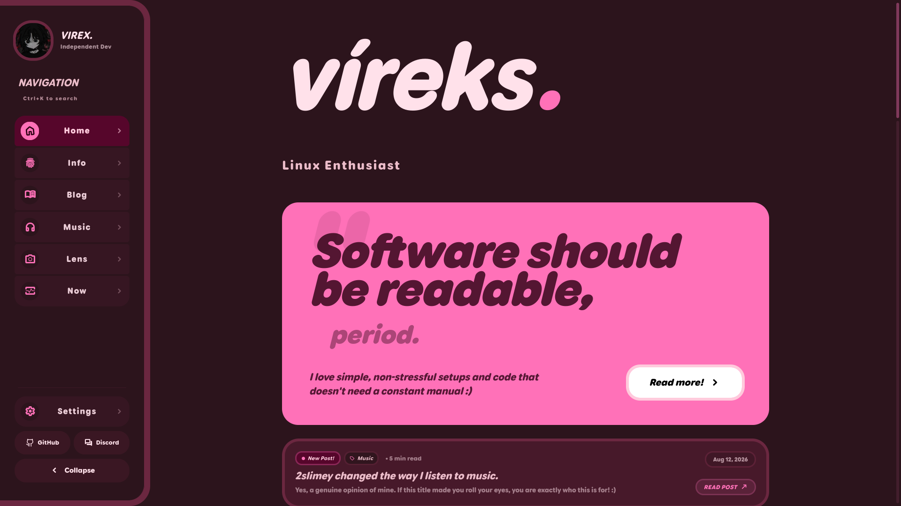
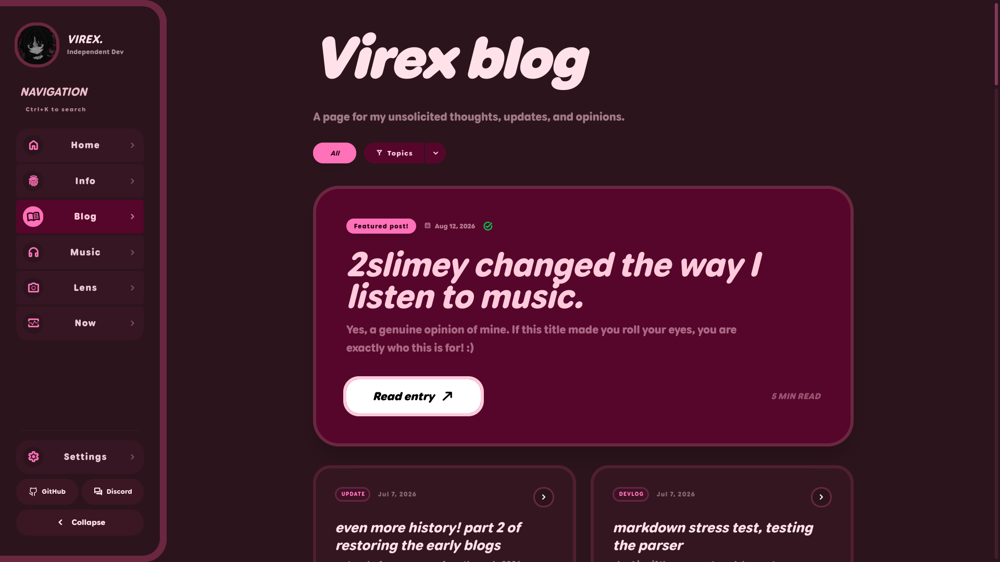
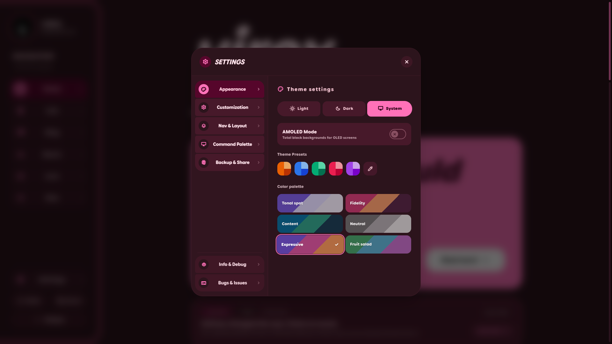
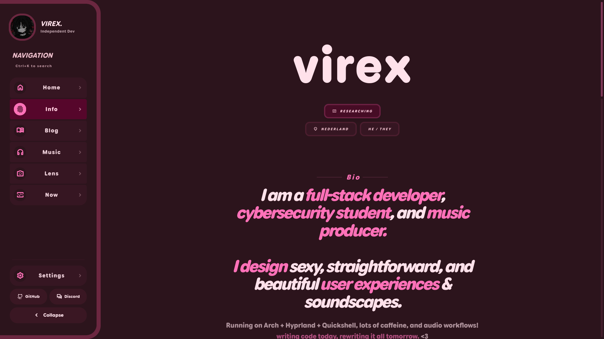
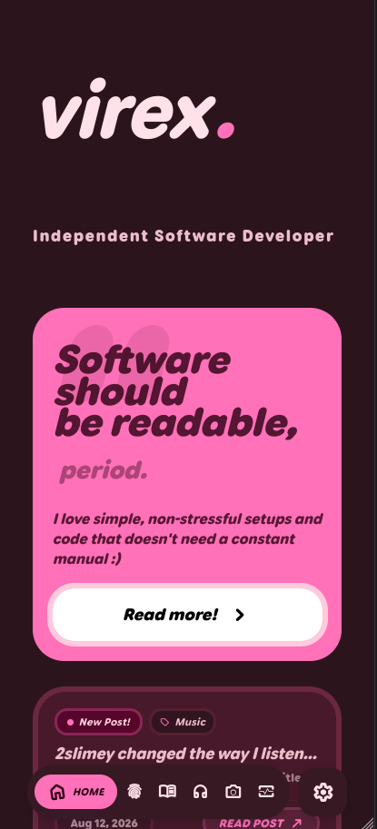
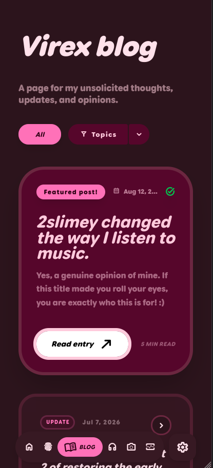
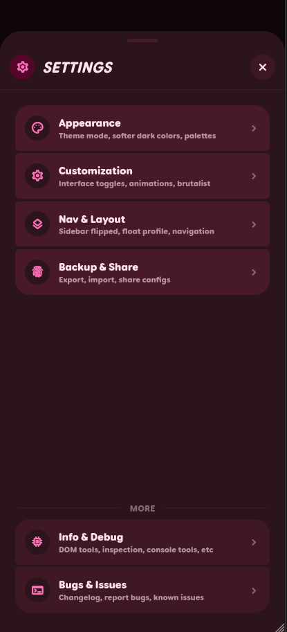
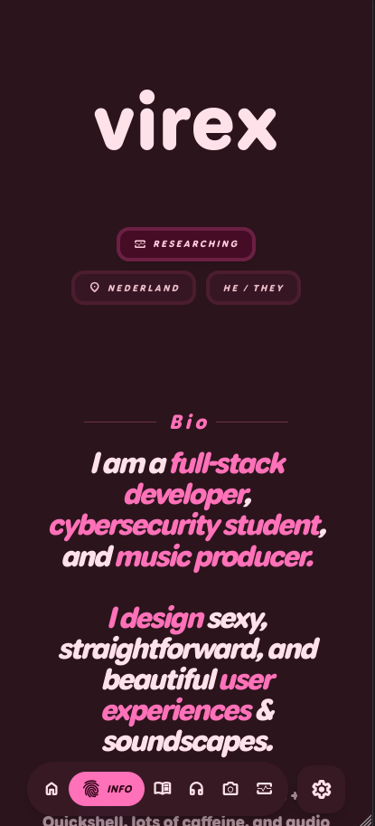

<div align="center">


### virex.lol


My personal website. Uses a Material 3 Expressive styled shell, photo gallery, blog, and features tons of customization options. Built on React 19. Research, photography, blog posts.

</div>


## What's new?

**New changes!**

- [Aug 9, 2026]  command palette feature

> last updated: Aug 9, 2026 — [full commit history](https://github.com/hnpf/virex.lol/commits/main)

---

## Site Screenshots

**Desktop**
<table>
  <tr>
    <td></td>
    <td></td>
    <td></td>
    <td></td>
  </tr>
  <tr>
    <td align="center"><sub>home</sub></td>
    <td align="center"><sub>blog</sub></td>
    <td align="center"><sub>settings</sub></td>
    <td align="center"><sub>info</sub></td>
  </tr>
</table>

**Mobile**
<table>
  <tr>
    <td></td>
    <td></td>
    <td></td>
    <td></td>
  </tr>
  <tr>
    <td align="center"><sub>home</sub></td>
    <td align="center"><sub>blog</sub></td>
    <td align="center"><sub>settings</sub></td>
    <td align="center"><sub>info</sub></td>
  </tr>
</table>

---

## Stack

| Layer | Tech |
|---|---|
| Frontend | React 19 + Vite 6, Tailwind 4, Motion (physics, advanced animation), Custom MaterialSymbolsRounded icons |
| Backend | Cloudflare, SQLite via `better-sqlite3` |
| Assets | webp via `sharp`, noise engine |

---

## Site Features

> **lens** — Bento-grid photo gallery. Swipe/drag, keyboard nav, and mobile friendly.

> **blog** — Updates, Devlogs, Cybersec, and more. Read-tracking + RSS at `/rss.xml` (not always updated!)

> **readme** — Clean bio and lore with animations with dedicated settings options.

> **now** — What I'm actively building, reading, and learning right now.

> **settings** — Accent hue, light/dark/system, highHz mode, brutalist mode (0px radii), zen mode, Jetbrains Mono override, and more.

---

## Getting Started

```bash
# clone + install
git clone https://github.com/hnpf/virex.lol
cd virex.lol
npm install        # or pnpm install

# dev
npm run dev        # vite + local api server

# prod
npm run build      # output to dist/
```

> You will need node 18+ and a sqlite-compatible env for the API routes. Your deployment method sometimes handles this automatically.

---

## Site Layout Snippet (updated ~v2.9.8-stable)

```
api/
  index.ts              server handlers (rss, express server, etc.)
  db.ts                 sqlite read/write logic
  guestbook_db.ts       guestbook backend, features banned_roots and leet map

public/
  fonts/                all locally stored and self-hosted material 3 symbols
  photography/          webp archive (compressed via sharp)
  _routes.json
  favicon.svg                 site favicon
  llms-full.txt
  llms.txt
  manifest.json
  robots.txt
  rss.xml
  sitemap.xml

src/
  components/           site components such as cards, copylinkcapsule, wavyprogress, etc.
  hooks/                site hooks such as useAprilFools, useViewport, and useSettingsSync.
  navigation/           nav components such as NavigationRail (and NavigationRailItem), and FAB
  pages/                site pages like blog, changelog, dash, home, lens, 404, /now, and readme.
  wavy.ts               wavy progress logic helper
  app.ts                core/root application class
  constants.ts          static info such as bug reports, projects, blog posts, and changelogs.
  haptics.ts            haptics for mobile; self explanatory
  index.css             also quite self-explanatory, holds some core styling logic and font data.
  main.tsx              main site entrypoint
  ThemeContext.tsx


```

---

<div align="center">

[virex.lol](https://virex.lol) · [github.com/hnpf](https://github.com/hnpf) · GPL-3.0

</div>
